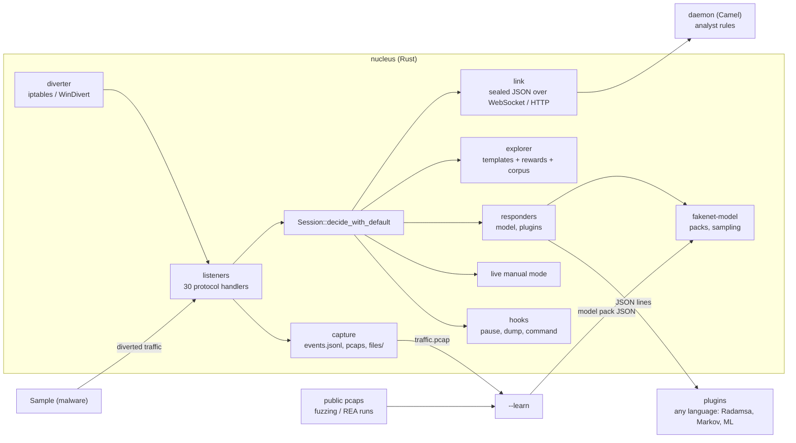
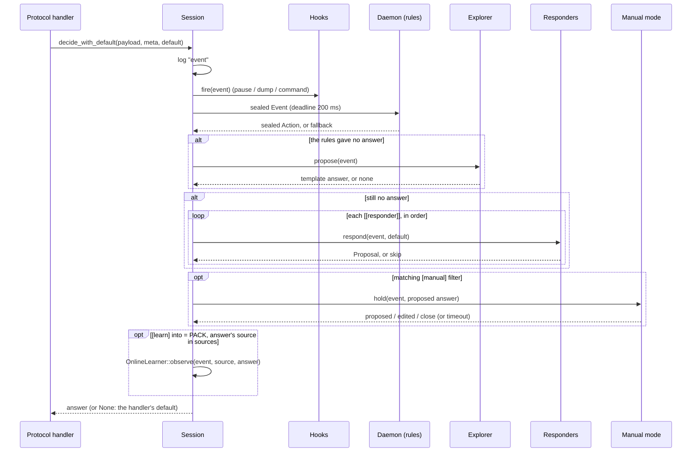
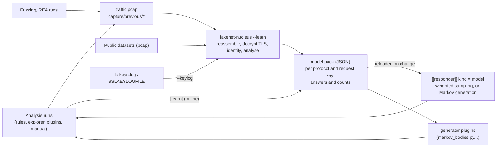

# Architecture

## Components

```mermaid
flowchart LR
    sample["Sample (malware)"] -->|diverted traffic| listeners
    subgraph nucleus["nucleus (Rust)"]
        diverter["diverter<br/>iptables / WinDivert"] --> listeners["listeners<br/>30 protocol handlers"]
        listeners --> session["Session::decide_with_default"]
        session --> link["link<br/>sealed JSON over WebSocket / HTTP"]
        session --> explorer["explorer<br/>templates + rewards + corpus"]
        session --> responders["responders<br/>model, plugins"]
        session --> manual["live manual mode"]
        session --> hooks["hooks<br/>pause, dump, command"]
        listeners --> capture["capture<br/>events.jsonl, pcaps, files/"]
        responders --> model["fakenet-model<br/>packs, sampling"]
    end
    link --> daemon["daemon (Camel)<br/>analyst rules"]
    responders -->|JSON lines| plugins["plugins<br/>any language: Radamsa, Markov, ML"]
    capture -->|traffic.pcap| learn["--learn"]
    datasets["public pcaps<br/>fuzzing / REA runs"] --> learn
    learn -->|model pack JSON| model
```

## Answering one request

```mermaid
sequenceDiagram
    participant H as Protocol handler
    participant S as Session
    participant K as Hooks
    participant D as Daemon (rules)
    participant E as Explorer
    participant R as Responders
    participant M as Manual mode
    H->>S: decide_with_default(payload, meta, default)
    S->>S: log "event"
    S->>K: fire(event) (pause / dump / command)
    S->>D: sealed Event (deadline 200 ms)
    D-->>S: sealed Action, or fallback
    alt the rules gave no answer
        S->>E: propose(event)
        E-->>S: template answer, or none
    end
    alt still no answer
        loop each [[responder]], in order
            S->>R: respond(event, default)
            R-->>S: Proposal, or skip
        end
    end
    opt matching [manual] filter
        S->>M: hold(event, proposed answer)
        M-->>S: proposed / edited / close (or timeout)
    end
    opt [learn] into = PACK, answer's source in sources
        S->>S: OnlineLearner::observe(event, source, answer)
    end
    S-->>H: answer (or None: the handler's default)
```

## The learning loop

```mermaid
flowchart LR
    run["Analysis runs<br/>(rules, explorer, plugins, manual)"] --> pcap["traffic.pcap<br/>capture/previous/*"]
    fuzz["Fuzzing, REA runs"] --> pcap
    public["Public datasets (pcap)"] --> learner
    keylog["tls-keys.log / SSLKEYLOGFILE"] -->|--keylog| learner
    pcap --> learner["fakenet-nucleus --learn<br/>reassemble, decrypt TLS, identify, analyse"]
    learner --> pack["model pack (JSON)<br/>per protocol and request key:<br/>answers and counts"]
    run -->|"[learn] (online)"| pack
    pack -->|"reloaded on change"| responder["[[responder]] kind = model<br/>weighted sampling, or Markov generation"]
    pack --> generators["generator plugins<br/>(markov_bodies.py...)"]
    responder --> run
    generators --> run
```
